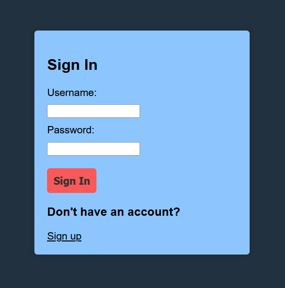
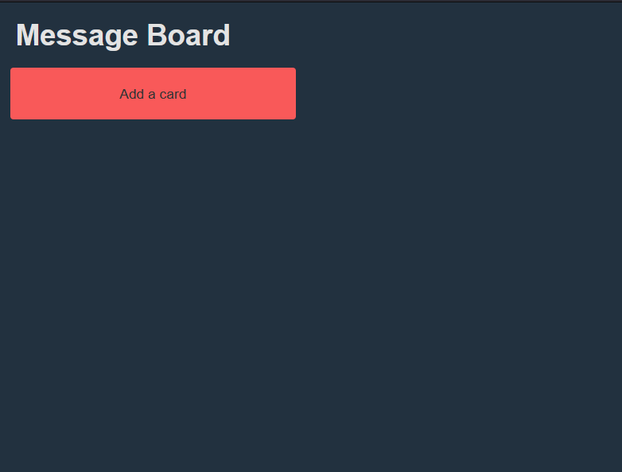
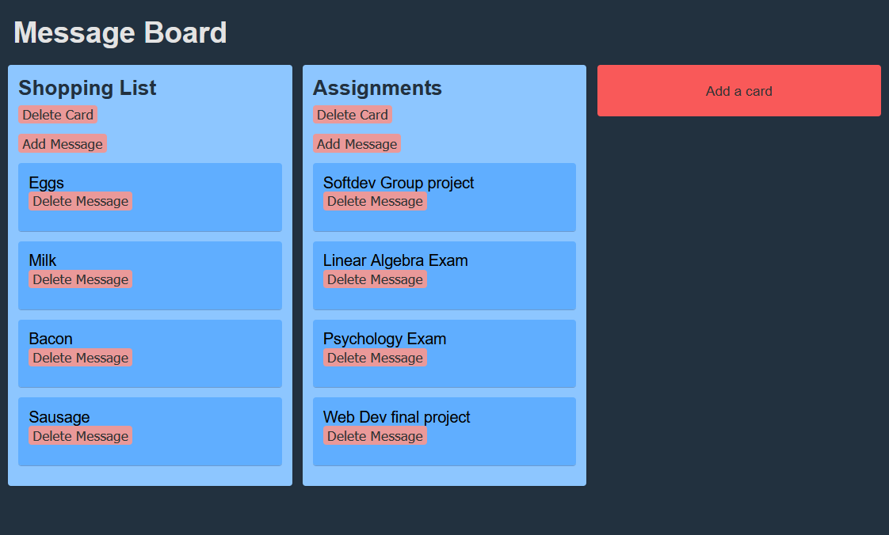

# Message Board
###### *This was a university project, copying code not allowed*

## Video link:
[Click here to view video](https://drive.google.com/file/d/19eqfYd9F9yesTnbcnGccNJKZSgimXL1h/view?pli=1)

## Developers:
* #### [Siddhant Das](https://github.com/Sid-26)
* #### [Sheida Ebrahimi Siaghi](https://github.com/Sheida-Ebrahimi) 
* #### [David Houle-Tymeczko](https://github.com/DavidHTwastaken)
* #### [Adam Orfao](https://github.com/oadam03)

## Requirements
* #### Intellij IDEA
* #### GlassFish 7.0.x

## How to run

1. Clone this repository on your device - you can do so by running the following command:
```git clone https://github.com/OntarioTech-CS-program/w23-csci2020u-project-team08#winter-2023-csci-2020u-systems-project-group-8```
2. Open the repository using Intellij
3. On the top right menu, next to the run button, click on 'Configurations' and then 'Edit configurations'
4. Click on 'Add configuration' then select Glassfish with a local server
5. Add 'domain1' - or your default domain - on the 'Server Domain' box
6. Switch to the Deployment tab, and click on the plus, then 'add artifact'. From there, add 'webboards: war exploded'
7. Click 'Apply', and then 'OK' and then click on the green arrow to run the server
8. An HTML webpage will be loaded on your browser with the URL: <http://localhost:8080/webboards-1.0-SNAPSHOT/>
9. If the webpage doesn't launch, you can simply access the link above in your preferred browser

## User Guide
#### You will have to sign up by typing in a new username and password.


#### If your sign up is successful, you will be sent to the home page. 


#### Once you're on the home page, you can create cards by clicking on the 'Add a card' button. Each card can have a title and as many attached messages as you'd like. You can also delete a message or card once you're done with it. If a different user joins, they will be able to see all of the changes to the shared message board once they log in.


#### If you're coming back to the website, you can always sign in using your previous credentials - just select the 'Sign in' button!


## External Resources
For our project, the primary requirements were `jakarta` for websockets and `org.json` for interpreting JSON documents on the server end. The `pom.xml` file, found in the main directory of the repository, contains a list of all the dependencies used in the project.
